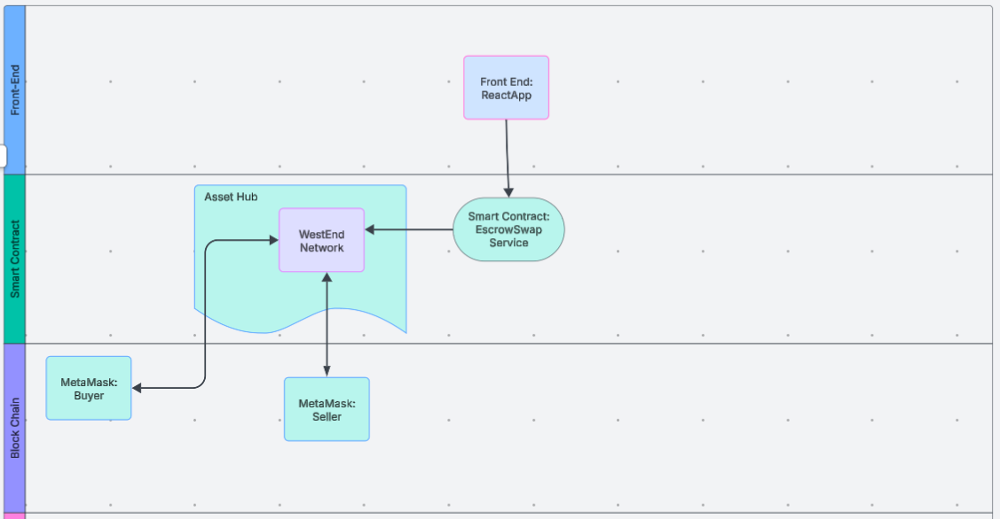
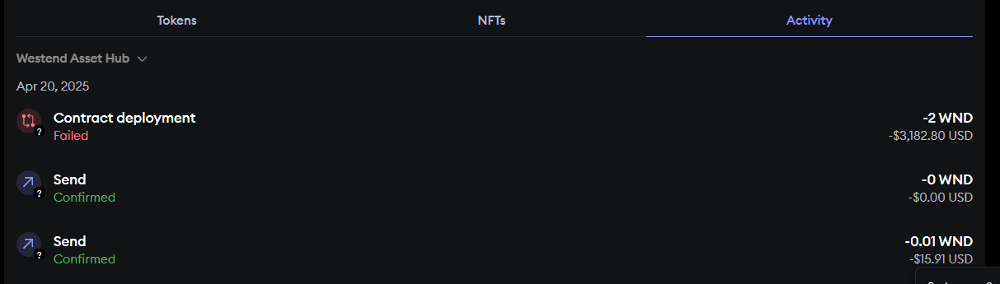
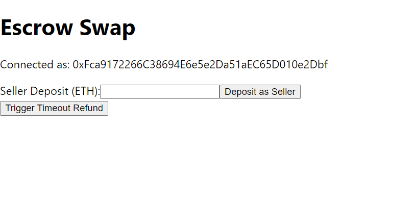
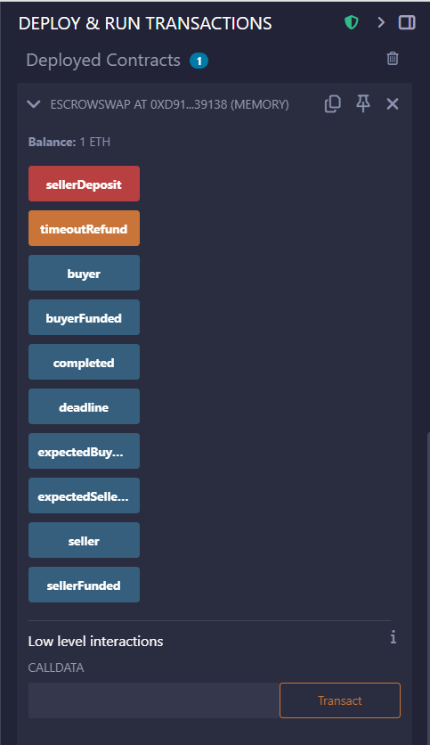

# EasyAHack
A decentralized Escrow swap app where the buyer deposits ETH, and the seller matches it; if conditions are met, funds are swapped, else refunded.
 
## Smart Contract Deployment

### A Solidity contract was deployed to the blockchain.
The contract holds ETH from both buyer and seller in escrow.
Constructor takes seller’s address, expected seller amount, and a timeout in seconds.  
   

### Frontend (React) Wallet Integration
Built with React and Ethers.js v6.
Connects to MetaMask using BrowserProvider and sets up a signer.
Displays connected wallet address.
Deposit Flow – Buyer & Seller
Buyer deploys the contract and deposits ETH to it.
Seller uses the UI  to send a matching deposit using sellerDeposit().

### Condition Check and Swap
The contract checks if both parties have deposited the expected amounts.
If true, ETH is distributed accordingly.
Timeout Refund Logic
If the seller doesn’t deposit in time, the buyer can trigger timeoutRefund() to retrieve their funds. 

